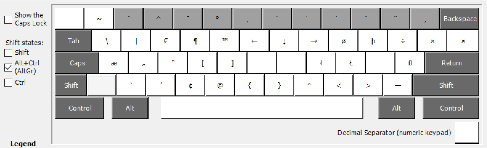
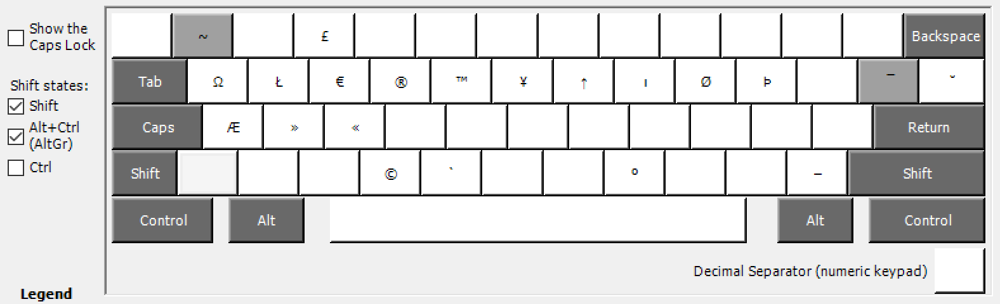

# Slovenska razporeditev tipk za Windows, ki temelji na Linux razporeditvi tipk

Ker je dodanih tipk ena celgafuka ([alot](http://hyperboleandahalf.blogspot.com/2010/04/alot-is-better-than-you-at-everything.html)), se bo najprej povzelo tipke, ki bojo dajale drugačne simbole, kot je navada.

## Spremenjene tipke v primerjavi s privzeto slovensko razporeditvijo tipkovnice na Windows:

* Krativec (`` ` ``) je sedaj mrtva tipka (dead key). Za različico, ki ni mrtva tipka, glej `shift alt-gr V`.
* `alt-gr M` sedaj vrača `^` namesto `§`
*Stvari za numerični del tipkovnice: ko pritisneš `shift` (oz. prižgeš caps lock), se decimalni simbol spremeni iz vejice (privzeti format za Slovenijo in večino Evrope) v piko (Severna Amerika, pa verjetno še kaj). Čestitke, caps lock je zdaj za eno zaokroževalno napako bolj uporaben kot prej.

## Spremenjene tipke v primerjavi z slovensko tipkovnico na Linux

* `alt-gr M` sedaj vrača `^` namesto `§`, tako kot ga je več kot 10 let (dokler ni nekdo tega spremenil en mesec nazaj)
* `alt-gr T` in `shift alt-gr T` dajeta `™` namesto `ŧŦ` ker kdo to uporablja
* Nekaj tipk tretjega in četrtega nivoja nisem dal v razporeditev, ker se mi ni dalo
* `~` je v linux mrtva tipka, tukaj pa (tako kot na Windows) ni. Dead key različica tipke je na `shift + alt-gr + 1`
* Zaenkrat nisem preveč pazil, da se tretjenivojske tipke ujemajo z Linux layoutom
* Stvari za numerični del tipkovnice: ko pritisneš `shift` (oz. prižgeš caps lock), se decimalni simbol spremeni iz vejice (privzeti format za Slovenijo in večino Evrope) v piko (Severna Amerika, pa verjetno še kaj). Čestitke, caps lock je zdaj za eno zaokroževalno napako bolj uporaben kot prej.

Nekega dne bo na voljo linux verzija s tem spremembami. Mogoče. Nobenih jamstev.

## Razporeditev

Prvi in drug nivo (ko ne pipaš 'alt gr') sta popolnoma enaka (razen tega, ko ), tako da bom preskočil.

### Ko pritisneš alt-gr

### Ko pritisneš shift + alt-gr

### Stvari, ki niso razvidne iz slik

`shift alt-gr presledek` da nelomljiv presledek ( `&nbsp;`)
`alt-gr 2 + [številka, +, -]` da podpisano številko ``, podpisan plus `₊` ali podpisan minus `₋`
`alt-gr 3 + [številka, +, -]` da nadpisano številko ``, nadpisan plus `⁺` ali nadpisan minus `⁻`

## Če hočete kucati kaj sami

[Microsoft Keyboard Layout Creator](https://www.microsoft.com/en-us/download/details.aspx?id=22339)

